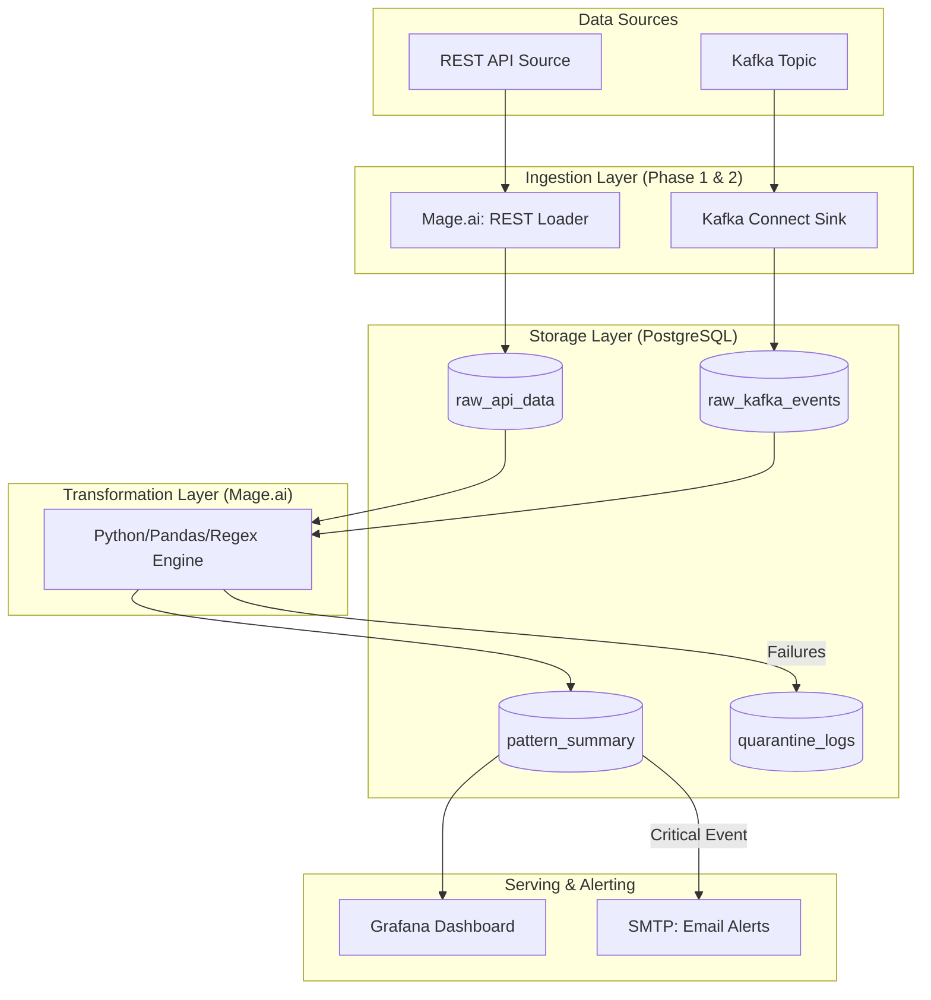
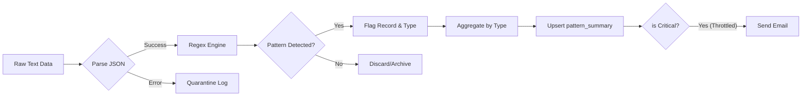
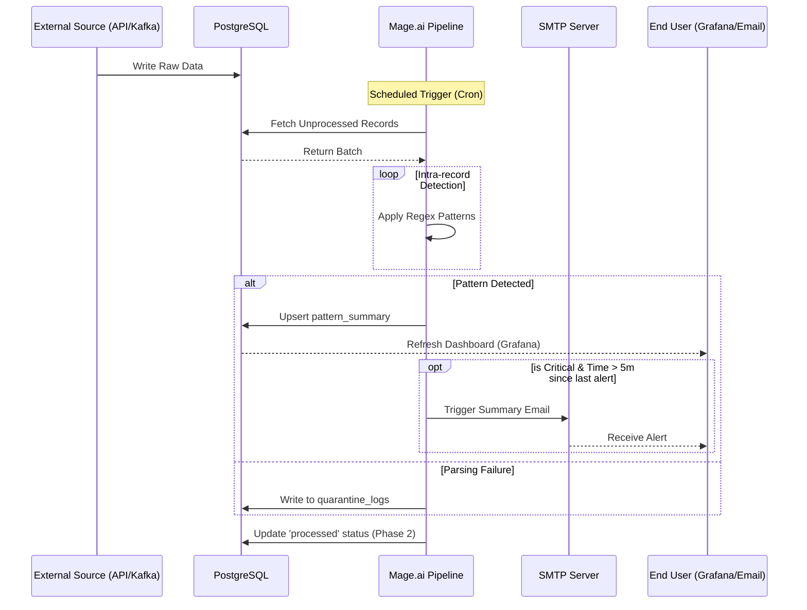

# System Diagrams: Text Pattern Monitoring Pipeline

This document provides visual representations of the system architecture, data flows, and process sequences.

## 1. System Architecture (Hybrid Phase 1 & 2)

This diagram shows the evolution from REST API ingestion to the Kafka-based stream ingestion while maintaining a consistent transformation and serving layer.

---

## 2. Data Flow Diagram (DFD)

Focusing on the transformation logic and state transitions.

---

## 3. Message Sequence Diagram (Alerting Pipeline)

Illustrating the timing and coordination between components.

